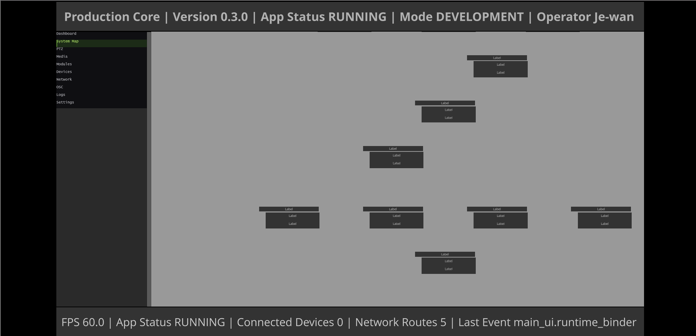
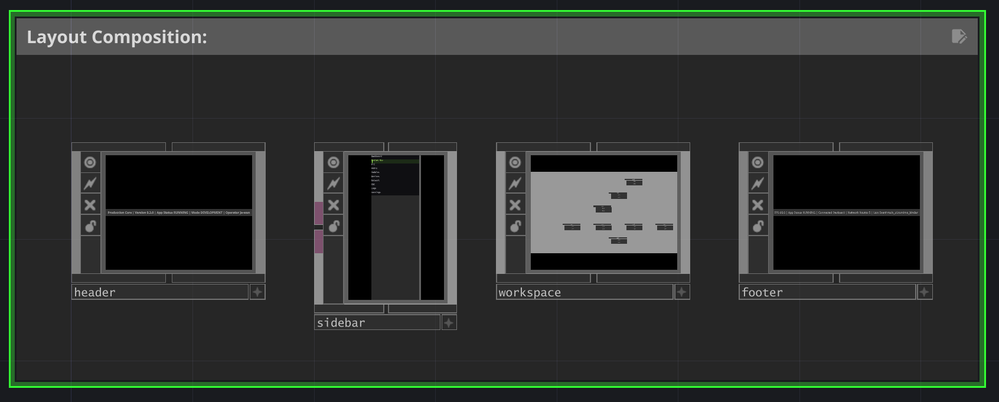

# Production Core SDK

### A software framework for connected production systems.

Production Core is a modular, TouchDesigner-based production systems SDK developed by J1VISIONS to connect, control, monitor, and represent the technologies that power modern live entertainment and immersive environments.

<p align="center">
  
</p>

<p align="center">
  <em>Current Production Core MAIN_UI runtime with the System Map workspace active. Node widgets are runtime-rendered; device-specific labels and metadata remain a future integration milestone.</em>
</p>

Live productions increasingly depend on interconnected ecosystems of media servers, video switchers, PTZ cameras, LED processors, networked devices, OSC/MIDI systems, show control, and custom software.

Production Core explores a simple question:

> What if these systems could share a common software architecture?

The project is being developed from the perspective of real-world touring, live production, media server, networking, and immersive technology workflows.

---

## Current Development State

Production Core has reached an **autonomous application runtime milestone**.

The application can cold-start into its operational runtime, bootstrap the MAIN_UI, populate the workspace, and maintain synchronized navigation state across the application's production pages.

### Verified Runtime Milestones

- Autonomous Production Core application cold start
- `AppExtension`: Ready / `booted=True` / `mode=dev`
- `MainUIRuntimeBinder`: `bootstrapped=True`
- MAIN_UI automatically populates on application launch
- Header, footer, sidebar, and workspace runtime systems integrated
- Workspace page architecture operational
- Active-page visual highlighting implemented
- Exact-row sidebar navigation verified
- Canonical navigation/state synchronization working
- System Map runtime integrated into MAIN_UI
- System Map node widgets render dynamically inside the application workspace
- Device-specific System Map metadata and labeling remain a future integration milestone
- Navigation between System Map and other workspace pages verified
- Defensive invalid-row behavior verified
- Operator testing across all sidebar pages passed

### Application Workspace

Production Core currently exposes ten primary workspace pages:

1. Dashboard
2. System Map
3. PTZ
4. Media
5. Modules
6. Devices
7. Network
8. OSC
9. Logs
10. Settings

### Runtime UI Composition

<p align="center">
  
</p>

<p align="center">
  <em>The MAIN_UI is composed from independently managed header, sidebar, workspace, and footer runtime components.</em>
</p>

---

## The Vision

Production Core is designed to become a software layer between production hardware, protocols, applications, and operators.

Instead of every integration becoming another isolated control system, Production Core provides reusable architecture for:

- State management
- Event-driven communication
- Device representation
- Production modules
- Network discovery
- Application lifecycle
- Logging and diagnostics
- UI/runtime synchronization
- Production system visualization

The long-term goal is not simply remote control.

The goal is to create a framework capable of understanding the production system itself.

---

## Architecture

<p align="center">
  
</p>

<p align="center">
  <em>Production Core manager architecture and system relationships.</em>
</p>

Production Core follows a manager-driven runtime architecture.

STATE → runtime truth  
EVENT → system communication  
LOGGER → runtime history  
CONFIG → persistent configuration  
APP → application lifecycle  
MODULE → production capabilities  
DEVICE → hardware representation  
NETWORK → connectivity and discovery

Modules represent **what the system can do**.

Devices represent **what hardware exists**.

State represents **what is true right now**.

Events allow the system to react when that truth changes.

### Runtime Flow

```text
PROJECT OPEN
     │
     ▼
AppExtension
Ready / booted=True / mode=dev
     │
     ▼
MainUIRuntimeBinder
bootstrapped=True
     │
     ▼
MAIN_UI
     │
     ├── Header
     ├── Sidebar
     ├── Workspace
     └── Footer
              │
              ▼
       Workspace Pages
              │
              ▼
     Runtime-bound systems
```

---

## Navigation Reliability

Recent development work corrected a UI coordinate-space mismatch between canonical navigation data and the rendered sidebar list.

The canonical `navigation_items` table contains a header row. That header is removed before the data reaches the visible List COMP, making rendered rows already zero-based. The previous callback applied the source-table header offset again, producing an off-by-one page mapping.

The corrected contract maps visible rows directly to page IDs:

```python
cb._ListRowToVisibleRow(..., 2) == 2
sb.GetPageIdForVisibleRow(2) == 'ptz'
cb._ListRowToVisibleRow(..., -1) is None
```

These checks passed, followed by successful operator testing across all ten sidebar pages.

This debugging milestone reinforced an important architectural rule: **canonical data coordinates and rendered UI coordinates must have an explicit, testable mapping contract.**

---

## Current Status

🚧 **Production Core is under active development.**

The runtime foundation, application boot process, MAIN_UI integration, workspace navigation, and System Map node rendering are operational. Device-specific System Map metadata and labeling are not yet implemented.

The public repository currently focuses on project documentation and architecture while Production Core is prepared for a future developer release. Source availability, packaging, installation requirements, and licensing are still being evaluated.

---

## Built For

Production Core is being designed around real production environments:

- Concert touring
- Media server systems
- Broadcast workflows
- Immersive installations
- Corporate production
- Experiential systems
- Show control
- Production networking

---

## Project Philosophy

Production technology should behave like an interconnected system, not a collection of isolated devices.

Production Core is an exploration of what happens when software engineering, production engineering, networking, and real-time technology are treated as one discipline.

---

## Development Roadmap

### Operational / Integrated

- Application lifecycle and autonomous boot
- Manager-driven runtime architecture
- MAIN_UI runtime binding
- Ten-page workspace architecture
- State-synchronized sidebar navigation
- Live System Map runtime integration
- Runtime System Map node rendering
- PTZ architecture and development foundation

### Active / Upcoming

- Media server integration
- OSC workflows and external control surfaces
- Expanded device discovery
- Video switcher integration
- Production network monitoring
- System Map interaction and visualization improvements
- Extensible third-party modules
- Public developer documentation and packaging

The roadmap will continue to evolve as Production Core moves from internal development toward broader developer and operator use.

---

## Public Repository Scope

This repository currently documents Production Core's architecture, development progress, selected interfaces, and public engineering milestones.

The complete internal TouchDesigner project, implementation source, deployment configuration, and unreleased integrations are not currently distributed through this repository.

---

## J1VISIONS

Production Core SDK is developed by J1VISIONS.

**Experience Systems Engineering for live entertainment and immersive technology.**
